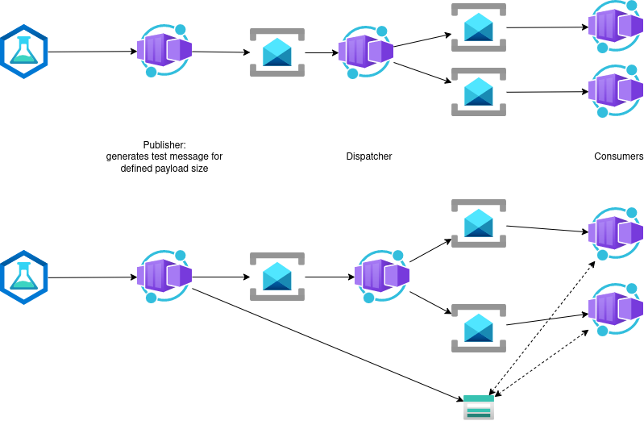

# Azure Service Bus - splitting payload and message meta data

Objective of this sample is to show the effects on scaling and throughput when pushing hugh payloads over multiple stages directly in Service Bus or when unloading payload into a blob (state) store.

